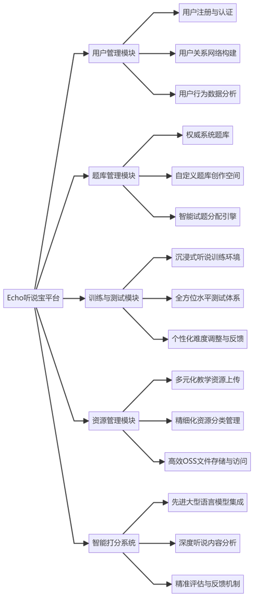
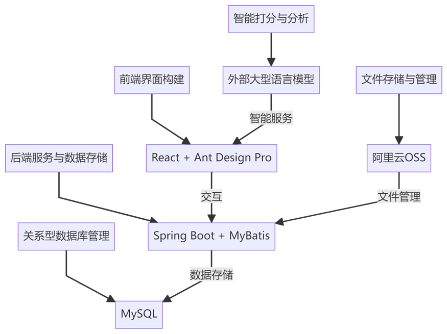

**Echo听说宝：国际语言环境大学生英语听说训练智能平台技术文档**

---

### 1. 技术关键和设计思路

**技术关键**：

- **后端技术**：Spring Boot框架与MyBatis的强强联合，为后端服务提供了强大的支持。Spring Boot以其轻量级、易于部署和高度可配置的特性，成为构建后端服务的理想选择。而MyBatis则以其简洁的SQL映射和高效的数据处理能力，确保了数据库操作的便捷性和性能。MySQL数据库作为可靠的关系型数据库管理系统，负责安全、高效地存储用户数据、题库信息等核心资源。
- **前端技术**：React框架与Ant Design Pro的完美结合，不仅提供了丰富的UI组件库，还确保了界面布局的灵活性和用户体验的卓越性。
- **文件存储与处理**：阿里云OSS（Object Storage Service）的集成，实现了文件的高速存储、便捷管理和高效访问，极大地提升了系统的文件处理能力。
- **智能打分技术**：利用外部大型语言模型，对用户的听说训练进行深度分析和精准打分，提供客观、全面的评估反馈。

**设计思路**：

- **高度模块化**：系统采用先进的模块化设计理念，确保了功能的灵活扩展和高效维护。
- **用户至上**：始终围绕学生和教师的核心需求进行功能设计，致力于提供个性化、智能化的服务体验。
- **智能推荐引擎**：通过先进的算法分析用户听说训练后的测试水平，智能推荐最适合的试题难度，实现个性化学习路径的定制。

### 2. 系统模块图和必要的说明

**系统模块图**：

**说明**：

- **用户管理模块**：提供完善的用户注册、登录流程，构建复杂的用户关系网络，并对用户行为进行深度分析。
- **题库管理模块**：涵盖丰富的系统默认题库，支持教师自由创建和编辑自定义题库，通过智能算法实现试题的精准分配。
- **训练与测试模块**：打造沉浸式的听说训练环境，提供全面的水平测试体系，并根据测试结果智能调整难度，给予个性化反馈。
- **资源管理模块**：支持多种教学资源的上传和管理，实现资源的精细分类，并通过OSS实现文件的高效存储和便捷访问。
- **智能打分系统**：集成先进的大型语言模型，对用户的听说训练内容进行深度分析，提供精准、客观的评估反馈。

### 3. 功能概述（包括子模块的功能）

- **用户管理**：提供用户注册、登录、个人信息管理、用户关系（教师-学生）管理等核心功能，构建丰富的用户画像和行为轨迹。
- **题库管理**：涵盖系统题库的全面浏览、自定义题库的灵活创建与编辑、以及基于智能算法的试题精准分配。MyBatis负责处理所有与数据库相关的操作，确保数据的准确性和高效性。
- **训练与测试**：打造沉浸式的听说材料训练环境，提供全面的在线水平测试体系，并根据测试结果智能推荐最适合的试题难度。
- **资源管理**：支持多种教学资源的便捷上传、精细化的资源分类管理，以及基于OSS的高效文件存储与访问。
- **智能打分**：利用先进的大型语言模型，对用户的听说训练内容进行深度分析，提供精准、全面的评估反馈，助力用户快速提升听说能力。

### 4. 技术架构图和必要的说明

**技术架构图**：

**说明**：

- 前端采用React框架与Ant Design Pro，共同构建出用户友好、功能丰富的界面。
- 后端依托Spring Boot框架与MyBatis，实现高效、稳定的服务与数据存储。MyBatis负责处理所有与数据库相关的操作，确保数据的准确性和高效性。
- MySQL数据库作为可靠的关系型数据库管理系统，负责安全、高效地存储用户数据、题库信息等核心资源。
- 阿里云OSS的集成，为文件存储和管理提供了强大的支持。
- 外部大型语言模型的引入，为用户的听说训练提供了精准、智能的打分与分析服务。

### 5. 技术亮点

- **智能试题分配算法**：基于用户听说训练后的测试水平，通过先进的算法智能推荐最适合的试题难度，实现个性化学习路径的定制。
- **高度模块化设计**：系统采用模块化设计理念，确保了功能的灵活扩展和高效维护，降低了后续升级和迭代的成本。
- **云存储与智能打分集成**：阿里云OSS的集成实现了文件的高效存储和管理，而外部大型语言模型的引入则为用户的听说训练提供了精准、智能的打分服务。
- **MyBatis优化**：利用MyBatis的强大数据处理能力，优化了数据库操作，提升了系统的整体性能。

### 6. 使用的软件和开发测试环境

- **开发工具**：IntelliJ IDEA、Visual Studio Code
- **数据库**：MySQL
- **服务器**：Apache Tomcat
- **版本控制**：Git
- **测试环境**：本地开发环境、阿里云服务器测试环境、大型语言模型测试环境

### 7. 开发难度

- **技术栈整合**：前端与后端技术的无缝整合，确保了数据交互的准确性和高效性，为用户提供了流畅的使用体验。
- **智能算法实现与优化**：试题分配算法和智能打分算法的实现与优化，确保了推荐的准确性和打分的公正性，为用户提供了个性化的学习路径和精准的评估反馈。
- **文件管理与大型语言模型集成**：阿里云OSS的集成实现了文件的高效存储和管理，而外部大型语言模型的引入则为系统增添了强大的智能打分功能，极大地提升了系统的整体性能和用户体验。同时，MyBatis的集成也增加了数据库操作的复杂性，需要精确处理SQL映射和事务管理。